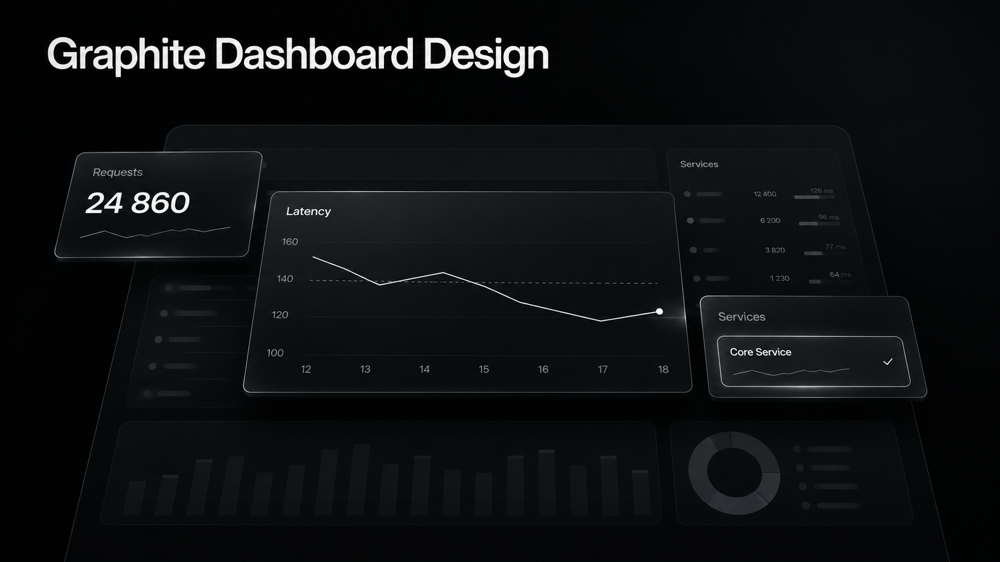
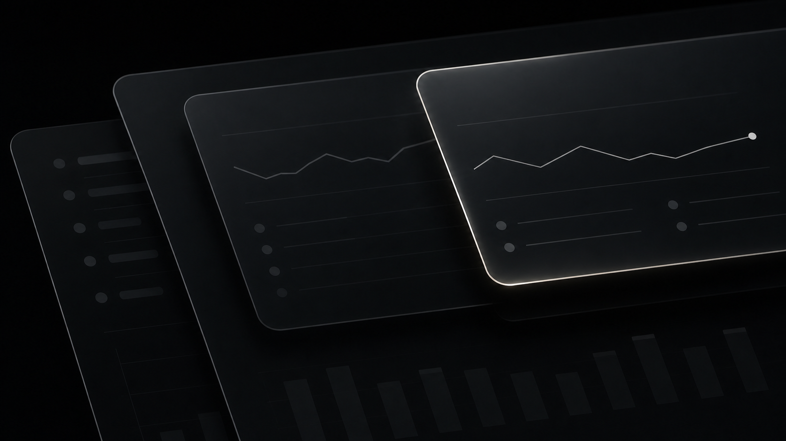
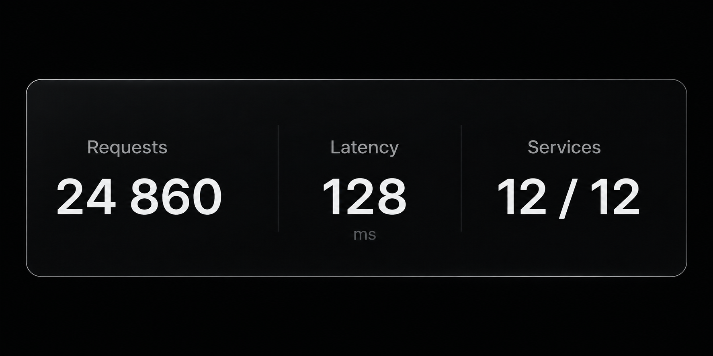

# Graphite Dashboard Design

A skill for designing dashboards in a black and graphite palette. It defines colors, typography, spacing, surfaces, and component states.

- [Agent instructions](SKILL.md)
- [CSS](assets/graphite.css)
- [Example screenshot](preview.png)

## What it changes

Panels get several levels of dark backgrounds, thin borders, and translucent fills. Numbers use Instrument Sans with tabular figures. Selected elements have a light outline and a subtle glow.



The layout depends on the task. Use the skill for tables, monitoring, analytics, or flow maps. It does not require you to copy the cover layout.

New dashboards use English by default. You can request another language separately. Existing projects keep their current languages.

Before creating or replacing icons, the agent asks whether you want custom-generated icons or a ready-made SVG set. Both follow the same restrained outline style: thin strokes, rounded ends, simple geometry, and a quiet active-state highlight. Generated images serve as references for small UI icons, with clean SVGs used in the interface.

Shared surface roles cover recessed work areas, regular panels, raised details, and overlays. Comfortable and compact spacing use the same type sizes. The [component gallery](examples/states.html) shows controls and data states you can test locally.

## Installation

Download the source archive from the [latest release](https://github.com/SLtowl/graphite-dashboard-design/releases/latest) and place its contents in:

```text
~/.codex/skills/graphite-dashboard-design/
```

This folder should contain `SKILL.md`, `assets`, and the other package files. Avoid an extra nested folder when extracting the download.

Invoke the skill in your task:

```text
Use $graphite-dashboard-design for a monitoring dashboard.
Include a service list, request latency, and open incidents.
```

For an existing interface:

```text
Apply $graphite-dashboard-design to this project.
Change the styling, but preserve the structure, data, and behavior.
```

Other agents may use a different installation path or invocation syntax. They need to support `SKILL.md` and its linked files.

## Reviews and team use

For a review without code changes:

```text
Use $graphite-dashboard-design to audit this dashboard.
Check hierarchy, numbers, density, and open controls. Report findings only.
```

Teams can share one version of the CSS and keep product overrides in a separate stylesheet. Pin an approved release when consistent output matters. Updating the skill does not update existing dashboards. See [team setup and upgrades](references/team-use.md).

## Automatic updates

Updates are off by default. After installation, ask your agent:

```text
Enable automatic updates for my installed graphite-dashboard-design skill.
```

Or run this command from the installed skill folder:

```sh
node scripts/update.mjs enable
```

Node.js 20 or newer is required only for the updater, not for the CSS or demo. When an agent follows the skill's instructions, it runs a local update check at the start of a task. After opt-in, the updater checks the latest stable GitHub release at most once per 24 hours and installs compatible updates. There is no background service, scheduler, or automatic execution when you merely open the demo.

Local edits stop the update. The previous version is backed up. Changes to the updater itself, the managed file list, or the major version require a manual upgrade. Existing dashboards are never updated by this process.

Version 1.2.0 adds package files, so upgrading from 1.1.x requires a reviewed manual installation. Test a separate copy first and preserve local changes. Automatic updates remain optional.

```sh
node scripts/update.mjs status
node scripts/update.mjs check
node scripts/update.mjs disable
node scripts/update.mjs rollback
```

The updater downloads only from this repository and does not run downloaded code. File hashes detect corruption, not a compromised maintainer account. Enabling updates means trusting future compatible skill instructions from this repository. GitHub receives normal connection metadata; no project files or credentials are uploaded. Git checkouts use manual updates.

See [update behavior and recovery](references/updates.md) for details. If your agent cannot run local commands, check or update manually.

## Example and source files

Open [examples/index.html](examples/index.html) locally in your browser. The font loads from the package, with no external requests. Click the cards to switch the selected state.

Open [examples/states.html](examples/states.html) for menus, validation, dialogs, density, and incomplete-data examples. These are working samples with synthetic data, not connected services.

The cover and the two detail images illustrate the style. The [screenshot](preview.png) shows rendered components.

- [SKILL.md](SKILL.md): style rules and workflow.
- [assets/graphite.css](assets/graphite.css): tokens and base components.
- [references/components.md](references/components.md): guidance for tables, charts, and navigation.
- [agents/openai.yaml](agents/openai.yaml): display name and suggested prompt for Codex.

You can use the CSS on its own. Copy `assets`, including the fonts folder, link the stylesheet, and add `gd-theme` to the container:

```html
<link rel="stylesheet" href="./assets/graphite.css">

<main class="gd-theme">
  <section class="gd-panel">
    <h2 class="gd-panel-title">System overview</h2>
  </section>
</main>
```

Theme tokens and component styles are scoped to descendants of the container. Component classes use the `gd-` prefix. The font-face declaration is document-wide.

The metric strip wraps within its container. Extremely long values remain available through a scrollable value region; keep it keyboard-focusable as in the example. Use `.gd-input` for labeled form fields. `.gd-glass` enables optional backdrop blur on a panel.

## Checks and browser support

The package includes updater tests, file-integrity checks, and an optional Playwright UI suite. See [test setup and coverage](references/testing.md) for commands and limitations. These are maintainer tools, not requirements for using the CSS.

Native select menus receive full styling where `appearance: base-select` is supported. Elsewhere they keep the system popup. For matching menus across browsers, use an accessible component from your project's stack and test its opened states.

## Fonts

[Instrument Sans](https://github.com/Instrument/instrument-sans) is included in the package. It is used for Latin text and numbers.



Cyrillic text falls back to the locally installed Segoe UI. That font is not included. On systems without Segoe UI, the browser selects another fallback, so Russian text may look different. Consistent rendering across operating systems requires a Cyrillic web font.

## License

Code and instructions: [MIT](LICENSE). Instrument Sans: [OFL](assets/fonts/OFL.txt).
